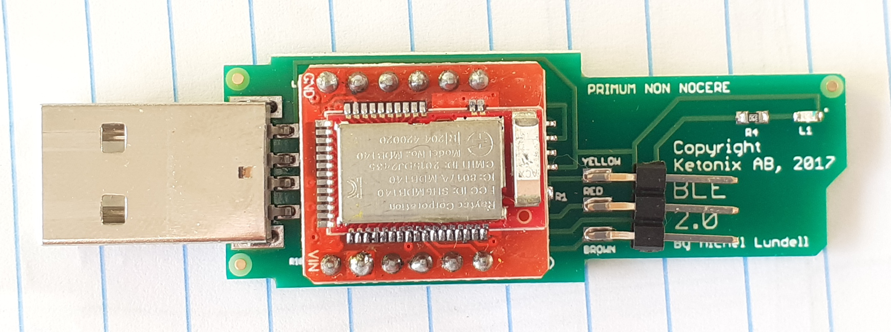
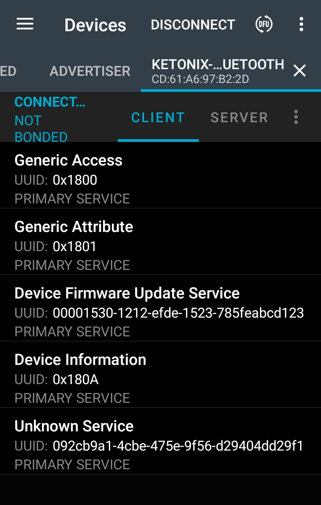
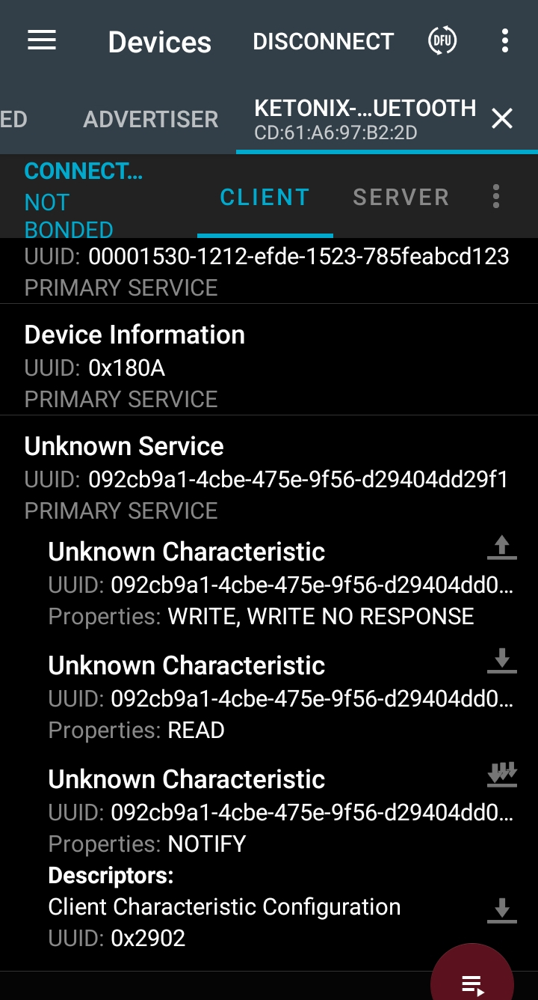

On this repository I am documenting the information I found about the Ketonix breath Ketone Analyzer, that I bought here and that I highly recommend: https://www.ketonix.com/ 
I hope this information is useful in the case you need to repair your unit and simple want to hack it.

I decided to see what is inside because I was curious about it, since I also bought a cheap 10€ Breathalyzer Breath Test Alcohol on EBay and it was not able to detect my low values of Acetone at around 5 PPM.

# Ideas for future

1. find way to access the data on the Bluetooth service 
OR 
2. connect a NRF52840 board in parallel to original board (only 3 wires to solder: 5V, GND and sensor analog signal) 
2.1 develop our own firmware, which should be quick to do thanks to Nordic SDK and many other OpenSource projects or Arduino 
2.3 use original app to see sensor voltage values and measured PPM values 
 
3. develop and OpenSource mobile app to have better graphs analysis and import / export our own data, etc 

# Main board

This is the main board of Ketonix (bought on November 2020):

See more pictures on the documentation folder.

Seems it was designed by Michel Lundell, the founder of Ketonix.
 
Note the reference to [PRIMUM NON NOCERE](https://en.wikipedia.org/wiki/Primum_non_nocere)!!

The red board seems to be the [RedBearLab BLE Nano](https://github.com/RedBearLab/BLENano), that has the famous Nordic nRF51822 Bluetooth microcontroller:
* Nordic nRF51822 SoC supports both BLE Central and BLE Peripheral roles
* Ultra low power ARM Cortex-M0 Core
* Support voltage from 1.8V to 3.3V
* 16MHz, 256KB Flash, 16KB RAM
* SWD Interface for nRF51822

If you are interested, [there are ways to dump the protected firmware from the nRF51822](http://hfdb.io/cpumcus/nordic-semi/nrf51822.html).

Some notes:
* the board power comes directly from the 5V on USB
* the sensor pins are:
  * BROWN wire: 5V USB
  * RED wire: GND
  * YELLOW wire: analog signal
* red board with nRF51822
  * P0.4 controls directly the blue LED
  * P0.5 is pin for input of sensor analog signal

Seems there is a kind of opamp under the red board that does an attenuation of the sensor signal by 0,577 (for instance: sensor analog signal = 520mv and nRF51822 P0.5 pin = 300mv).

# Sensor

The sensor seems to be the popular MQ3 alcohol sensor Module, very popular if you search for it and Arduino.

The sensor power is directly the USB 5V.

Seems there is a PCB near the sensor and I guess it also has another circuit specifically to power and manage the sensor calibration (??).

When the board is powered up, the sensor output signal increases up to voltages of 3 volts but after it decreases up to 2.2 volts. The, it quick goes to zero volts and just after quick increases up to 0.52 volts and stays there. When we breath out, if we do not have acetone, the voltage signal will goes lower than the 0.52 volts and higher if we have acetone - this is just equal what I saw on a cheap 10€ Breathalyzer Breath Test Alcohol from EBay!!

Here are some voltage measure on the nRF51822 P0.5, analog input signal of the sensor output signal (I measured while looking at the Ketonix app showing the value in PPM): 
0.640 V | 1 PPM 
0.880 V | 2 PPM 
1.180 V | 5 PPM 
1.260 V | 6 PPM 
1.320 V | 7 PPM 

# Bluetooth

The mobile app is very limited, we can´t export or import and data, can´t see more than last 7 days or zoom in and out the graph, etc.

We can see on the Nordic NRFConnect mobile app the Bluetooth services available:

